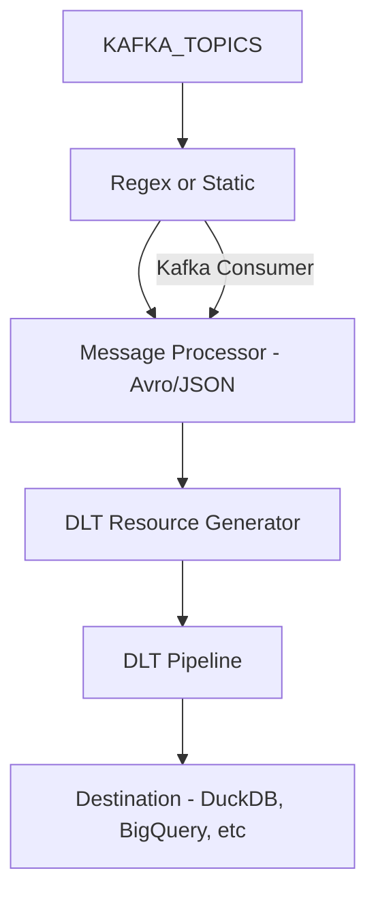

# 🧾 DLT Kafka Ingestion Framework — Technical Design Document

**Author:** Emmanuel Ogunwede  
**Repository:** GitHub – [grokking-dlt-kafka](https://github.com/JesuFemi-O/grokking-dlt-kafka)  
**Status:** Draft

---

## 1. Overview

This document describes the architecture, requirements, and design decisions behind a Kafka-to-DLT ingestion framework that leverages dlt (Data Load Tool) to move data from Kafka topics into structured analytical destinations like DuckDB.

The system supports micro-batch ingestion, config-driven pipelines, and extensibility for serialization formats, making it suitable for both prototyping and production workloads.

---

## 2. Goals

- Build a reusable, CLI-driven ETL framework to read from Kafka and write into any DLT-supported destination.
- Support JSON and Avro-encoded messages (via Confluent Schema Registry).
- Enable dynamic topic discovery via regex pattern matching.
- Abstract offset management and consumer configuration.
- Allow self-service ingestion through YAML configuration.

---

## 3. Problem Statement

Out-of-the-box, dlt provides a Kafka source that:
- Requires hardcoded topic names
- Has limited support for Avro deserialization
- does not support adding new topics to an existing pipeline post-first-run

While these limitations don’t diminish the value of dlt’s core offering, they highlight areas where additional tooling is needed to meet the expectations of a production-grade ingestion framework. 

This project proposes enhancements to fill those gaps with minimal glue code and a strong declarative developer experience.

---

## 4. Key Features

| Feature | Vanilla dlt-kafka | Enhanced Framework |
|--------|-------------------|--------------------|
| Static + Regex Topic Support | ❌ | ✅ |
| Avro + JSON Support | ❌ (JSON only) | ✅ |
| Schema Registry Integration | ❌ | ✅ |
| Topic Reconfiguration | ❌ Runtime breaks | ✅ Dynamic Topic Handling |
| CLI Wrapper | ❌ | ✅ |
| YAML-driven Pipelines | ❌ | ✅ |
| Extensible Processors | ❌ | ✅ |


---

## 5. Design Overview

### 5.1 Pipeline Flow



### 5.2 Components

- **Consumer Factory**: Builds a confluent_kafka.Consumer from credentials or config
- **Message Processor**: Handles deserialization (e.g., JsonProcessor, AvroProcessor)
- **Offset Tracker**: Persists offsets across runs and adapts to new topics
- **Pipeline Runner**: CLI tool to execute pipeline from kafka.yml definition
- **Resource Generator**: Wraps Kafka consumption in a dlt.Resource

---

## 6. System Behavior

### 6.1 Topic Subscription

The system supports:
- Static topic lists (e.g., `topics: ["user_topic", "product_topic"]`)
- Regex-based topic discovery (e.g., `topics_regex: ".*_json_topic"`)

On each run:
- Kafka metadata is queried
- Matching topics are dynamically subscribed
- If topic list has changed since last run, new topics are included automatically

### 6.2 Offset Management

- The offset tracker handles per-topic, per-partition offset storage (e.g., in a sidecar file or checkpoint table)
- First-run and resumed runs support start-from-earliest or start-from-specific-offset

### 6.3 Serialization Support

#### JSON

- Assumes schema-less messages
- Extracts all fields into flat records

#### Avro

- Schema-aware parsing via Confluent Schema Registry
- Extracts fields based on latest schema ID registered for the topic
- Requires schema registration before ingestion

Avro support is opt-in, and requires specifying `serializer: avro` in the config.

### 6.4 CLI Usage

```bash
docker exec -it dlt-pipeline-runner \
  uv run python src/kafka_runner.py \
  --resource avro_users \
  --destination duckdb
```

### 6.5 YAML Configuration Example

```yaml
- name: avro_users
  kafka:
    consumer_group_id: user_ingestor
    topics_regex: ".*_avro_topic"
    security_protocol: PLAINTEXT
  processing:
    serializer: avro
    target_table: users_table
    batch_size: 500
    batch_timeout: 3
```

---

## 7. Implementation Notes

- A `configspec` class (`KafkaCredentials`) maps Kafka fields from snake_case to the dotted Kafka client format
- Environment variables (`.env`) are loaded via `dotenv` and passed into dlt’s credential classes
- Topic configuration is decoupled from the code via `kafka.yml`

---

## 8. Limitations / Out of Scope

| Area | Status | Notes |
|------|--------|-------|
| Protobuf Support | ❌ | Planned extensibility point |
| Cloud Deployment Automation | ❌ | Out of scope for now |
| Monitoring/Alerting | ❌ | Not built-in |
| Dead Letter Queues (DLQs) | ❌ | Could be added via plugin model |

---

## 9. Future Work

- Protobuf deserialization via plugin
- Support for reading from AWS MSK clusters with IAM based authentication
- Integration with orchestration tools (Airflow, Prefect, etc.)


---

## 10. Summary

This project aims to productionize Kafka → DLT pipelines by embracing declarative config, modular processors, and dynamic topic discovery. It’s especially suited for teams adopting micro-batch streaming and schema-based ingestion without managing Spark or Flink infrastructure.